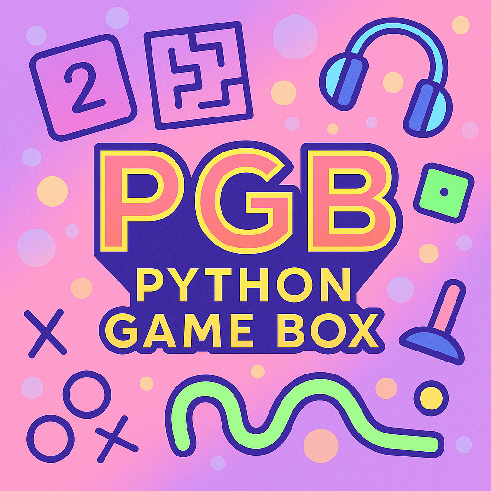

<p align="center">
  
</p>

<h1 align="center">Python Game Box (PGB) | Flash Revival</h1>

<p align="center">
  <strong>A collection of classic Flash games rebuilt with pure Python & Web</strong>
</p>

<p align="center">
  <a href="https://x.com/HAKORAdev">
    
  </a>
  <a href="https://github.com/HAKORADev/Python_Game_Box_PGB">
    
  </a>
</p>

---

## About

Python Game Box (PGB) is a nostalgic tribute to the golden age of Flash games. It features a curated collection of classic mini-games, originally written in **100% pure Python code**, and now expanding into **web-based games** powered by Three.js and React — run locally with a single command.

### Key Features

- **Pure Python**: All Python games are built from scratch using only Python and standard libraries
- **Web Games**: Browser-based games powered by Next.js, Three.js, and React — just `npm run dev`
- **Lightweight**: Simple, fast, and easy to run
- **Nostalgic**: Brings back the fun of classic Flash-era mini-games
- **Cross-Platform**: Python source code runs on Windows, Linux, and macOS; Web games run anywhere
- **Extensible**: Add new language ports under src/ (e.g. src/cpp/, src/web/)

---

## 🐍 Web Games (v0.1.0)

<p align="center">
</p>

| Game | Type | Description |
|------|------|-------------|
| 🐍 **3D Snake** | Arcade | 3D Snake with path tracing, day/night cycle, arcade mode, 6 power-ups, CPU rival |

### Run 3D Snake Locally

```bash
cd src/web/v0.1.0/Snake3D/
npm install
npm run dev
```

Then open **http://localhost:3000** in your browser.

> Requires [Node.js](https://nodejs.org/) v18+ and a modern browser with WebGL 2 support.

---

## Repository Structure

```
PGB/
├── docs/                    # Documentation
│   ├── changelog.txt        # Full version history
│   ├── Controls.txt         # Game controls reference
│   ├── about.txt            # Project overview
│   ├── v1.3.5_readme.txt    # v1.3.5 release notes
│   └── v1.3.8_readme.txt    # v1.3.8 release notes
├── src/
│   ├── python/              # Python source code
│   │   ├── v1.3.5/          # 13 games
│   │   └── v1.3.8/          # 14 games (Pop TD added)
│   └── web/                 # Web source code
│       └── v0.1.0/          # Web games v0.1.0
│           ├── Snake3D/     # 3D Snake (Next.js + Three.js)
│           ├── readme.md    # Web version readme
│           ├── about.txt    # About this version
│           ├── controls.txt # Controls reference
│           └── changelog.txt# Version changelog
├── assets/                  # Game screenshots (all versions)
├── logo.png                 # Project logo
├── showcase.md              # Screenshot gallery
├── requirements.txt         # Python dependencies
├── LICENSE
└── README.md
```

The `src/` directory is organized by language/platform. Drop any new source code into `src/<language>/<version>/`. For example, to add C++ ports: `src/cpp/v1.3.8/`. This structure makes it easy to:
- Add new language ports under `src/`
- Track which games exist in each version
- Keep source code separated by platform

---

## Game Collection (Python — v1.3.8 — 14 Games)

> 📸 **[View all screenshots →](showcase.md)** — Every game across every version

| Game | Type | Description |
|------|------|-------------|
| **2048** | Puzzle | Classic number puzzle with single player and VS mode |
| **Cosmic Spud** | Shooter | Survival shooter with auto-fire, 10 enemy types, upgrade system |
| **Dario** | Platformer | Platformer with coins, enemies, and power-ups |
| **Escape The Maze** | Puzzle | Navigate procedurally generated mazes |
| **Fruit Slasher** | Arcade | Slice fruits with mouse swipes, avoid bombs |
| **Geometry Flash** | Arcade | Switch lanes to avoid obstacles |
| **Hen Invaders** | Arcade | Space invaders with power-ups and 2-player mode |
| **Keyboard Singer** | Music | 10 instruments, multiple play modes |
| **Matcher** | Puzzle | Match-3 gem puzzle with special powers |
| **Pop TD** | Strategy | Tower defense — 6 tower types, 15 waves, upgrade paths *(v1.3.8+)* |
| **Pong** | Arcade | Classic ping pong with AI and multiplayer |
| **Snake** | Arcade | Classic snake with AI mode and 2-player support |
| **Snowy Tower** | Platformer | Jump between platforms to climb higher |
| **XO** | Puzzle | Tic Tac Toe with 4 AI difficulties |

---

## Downloads

### Legacy Windows Executables (v1.0–v1.1.1)

| Version | Download | Description |
|---------|----------|-------------|
| **v1.1.1** | [MediaFire](https://www.mediafire.com/file/dpj5sopetnzvv86/Python_Game_Box_V1.1.1.zip/file) | Bug squash patch |
| **v1.1** | [MediaFire](https://www.mediafire.com/file/pur1laddvdj073a/Python_Game_Box_V1.1.exe/file) | Game Box Update (Matcher added) |
| **v1.0** | [MediaFire](https://www.mediafire.com/file/8gdnugakadw978c/Python_Game_Box.exe/file) | Initial release (10 games) |

> **Note**: These are pre-compiled Windows executables. The itch.io page is no longer available. Source code for v1.3.5+ is available in this repository.

### Running Python Games from Source

1. Install Python 3.x
2. Install dependencies: `pip install -r requirements.txt`
3. Run any game: `python src/python/v1.3.8/<game>.py`

### Running Web Games Locally

1. Install [Node.js](https://nodejs.org/) (v18+)
2. Navigate to a web game: `cd src/web/v0.1.0/Snake3D/`
3. Install dependencies: `npm install`
4. Start dev server: `npm run dev`
5. Open [http://localhost:3000](http://localhost:3000)

---

## Version History

| Version | Date | Games | Highlights |
|---------|------|-------|------------|
| **Web v0.1.0** | May 2026 | 1 (web) | 3D Snake — first web game, Three.js, arcade mode, power-ups |
| **v1.3.8** | May 2026 | 14 | Pop TD added (tower defense) |
| **v1.3.5** | Mar 2026 | 13 | Cosmic Spud + Fruit Slasher, major improvements |
| **v1.1.1** | Apr 2025 | 11 | Bug fixes across 8 games |
| **v1.1** | Apr 2025 | 11 | Matcher added, 2-player modes, visual upgrades |
| **v1.0** | Apr 2025 | 10 | Initial release |

See [docs/changelog.txt](docs/changelog.txt) for the full detailed changelog.

---

## Technical Details

### Python Games
- **Language**: 100% Pure Python
- **Libraries**: PyQt5, Pygame, Pymunk, Pyganim, NumPy, SciPy
- **Optional**: PyOpenGL (GPU rendering in Pop TD)
- **Platform**: Windows, Linux (source), macOS (source)
- **FPS**: Consistent 60 FPS across all games
- **Audio**: Procedurally generated (no external audio files)

### Web Games
- **Framework**: Next.js 16 (React 19)
- **3D Engine**: Three.js + React Three Fiber + React Three Postprocessing
- **Styling**: Tailwind CSS 4 + shadcn/ui
- **State**: Zustand
- **Platform**: Any modern browser with WebGL 2
- **Audio**: Web Audio API (procedurally generated)

---

## Why Pure Python?

Every Python game in this collection is written entirely in Python without using game engines like Unity or Godot. This demonstrates what's possible with standard Python libraries and serves as a testament to the language's versatility.

---

## License

This software is provided for personal, commercial use. See the included LICENSE file for more details.

---

## Contact

- **X/Twitter**: [@HAKORAdev](https://x.com/HAKORAdev)
- **GitHub**: [HAKORADev](https://github.com/HAKORADev)

---

## Acknowledgments

- The Flash game community for inspiring generations of web games
- Python Software Foundation for an amazing programming language
- The Three.js and React Three Fiber communities for incredible 3D web tools
- Everyone who enjoys nostalgic gaming experiences!
